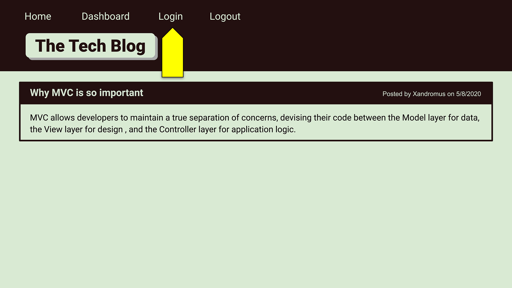

# Tech_Blog

## Background
```md
AS A developer who writes about tech
I WANT a CMS-style blog site
SO THAT I can publish articles, blog posts, and my thoughts and opinions
```

## Tech_Blog Targets

```md
GIVEN a CMS-style blog site
WHEN the user visits the site for the first time
THEN they are presented with the homepage, which includes existing blog posts if any have been posted; navigation links for the homepage and the dashboard; and the option to log in
WHEN the user clicks on the homepage option
THEN they are taken to the homepage
WHEN the user clicks on any other links in the navigation
THEN they are prompted to either sign up or sign in
WHEN the user chooses to sign up
THEN they are prompted to create a username and password
WHEN the user clicks on the sign-up button
THEN the users credentials are saved and they are logged into the site
WHEN the user revisits the site at a later time and chooses to sign in
THEN they are prompted to enter their username and password
WHEN the user signs in to the site
THEN the user sees navigation links for the homepage, the dashboard, and the option to log out
WHEN the user clicks on the homepage option in the navigation
THEN they are taken to the homepage and presented with existing blog posts that include the post title and the date created
WHEN the user clicks on an existing blog post
THEN they are presented with the post title, contents, post creator’s username, and date created for that post and have the option to leave a comment
WHEN the user enters a comment and clicks on the submit button while signed in
THEN their comment is saved and the post is updated to display the comment, the comment creator’s username, and the date created
WHEN the user clicks on the dashboard option in the navigation
THEN they are taken to the dashboard and presented with any blog posts they have already created and the option to add a new blog post
WHEN the user clicks on the button to add a new blog post
THEN they are prompted to enter both a title and contents for their blog post
WHEN the user clicks on the button to create a new blog post
THEN their title and contents of their post are saved and they are taken back to an updated dashboard with their new blog post
WHEN the user clicks on one of their existing posts in the dashboard
THEN they are able to delete or update their post and are taken back to an updated dashboard
WHEN the user clicks on the logout option in the navigation
THEN they are signed out of the site
WHEN the user is idle on the site for more than a set time
THEN they are able to view comments but are prompted to log in again before they can add, update, or delete comments
```

## Preview

 

## Repository & Webpage:
- GitHub Repository: https://github.com/mgmedrano/Tech_Blog
- Heroku Website: 